# Hasil Query SQL Perpustakaan

Dokumentasi ini menampilkan hasil eksekusi query pada file query_tugas.sql.

## Struktur Folder

- query_tugas.sql
- images/1.png sampai images/17.png

## Hasil Query

### 1. Total buku seluruhnya
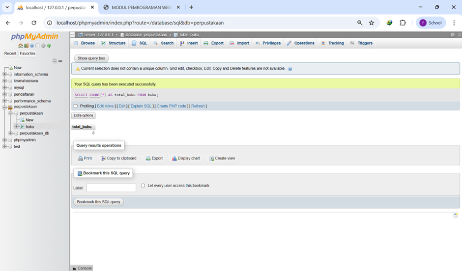

### 2. Total nilai inventaris (sum harga x stok)
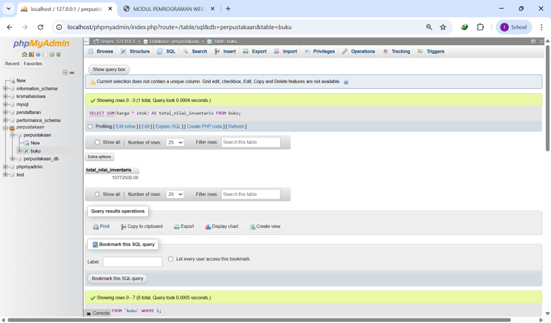

### 3. Rata-rata harga buku
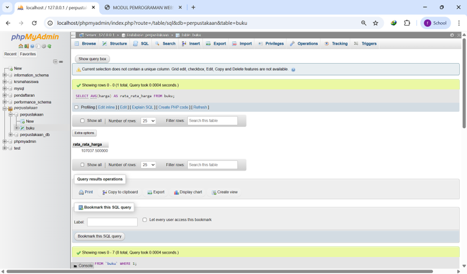

### 4. Buku termahal (judul dan harga)

### 5. Buku dengan stok terbanyak
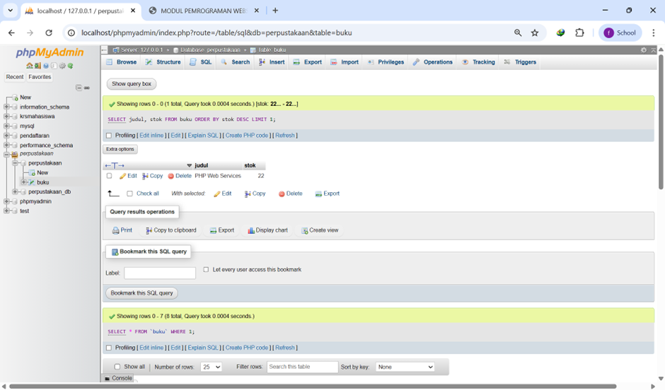

### 6. Semua buku kategori Programming yang harga < 100000
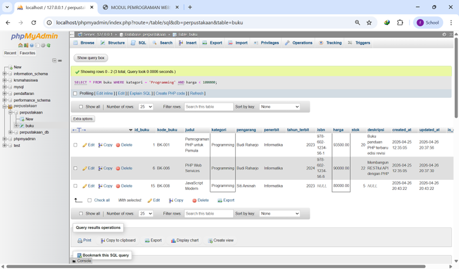

### 7. Judul mengandung kata PHP atau MySQL
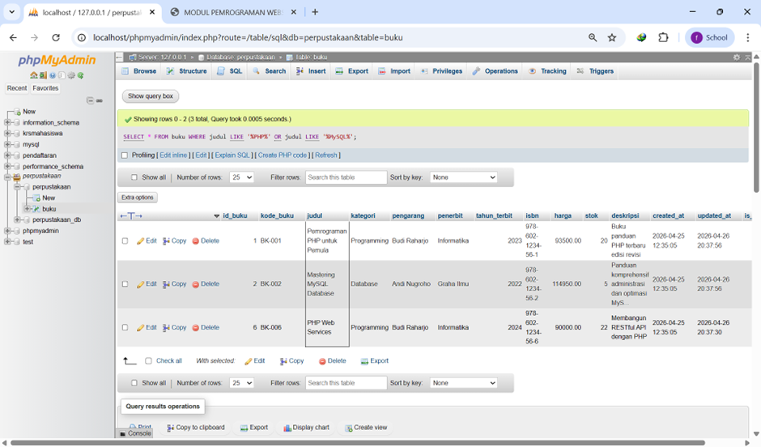

### 8. Buku terbit tahun 2024
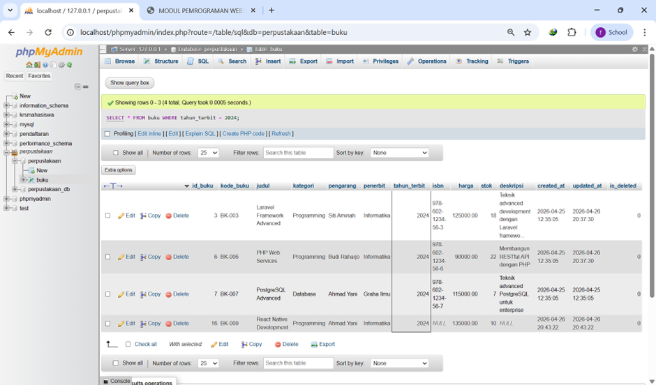

### 9. Buku dengan stok antara 5 sampai 10
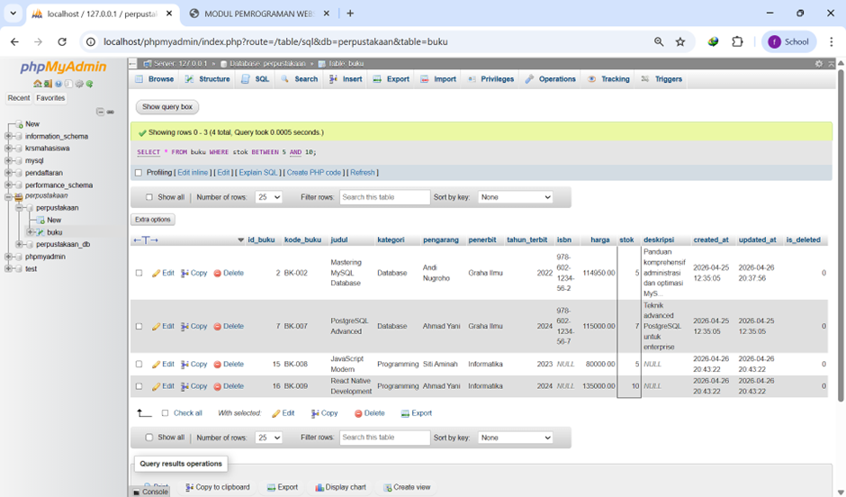

### 10. Buku dengan pengarang Budi Raharjo
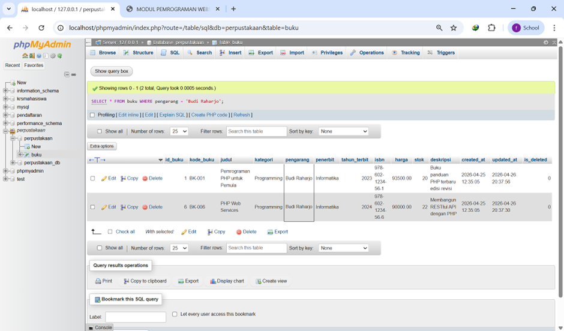

### 11. Jumlah buku per kategori dan total stok per kategori
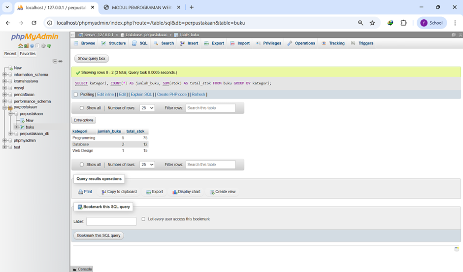

### 12. Rata-rata harga per kategori
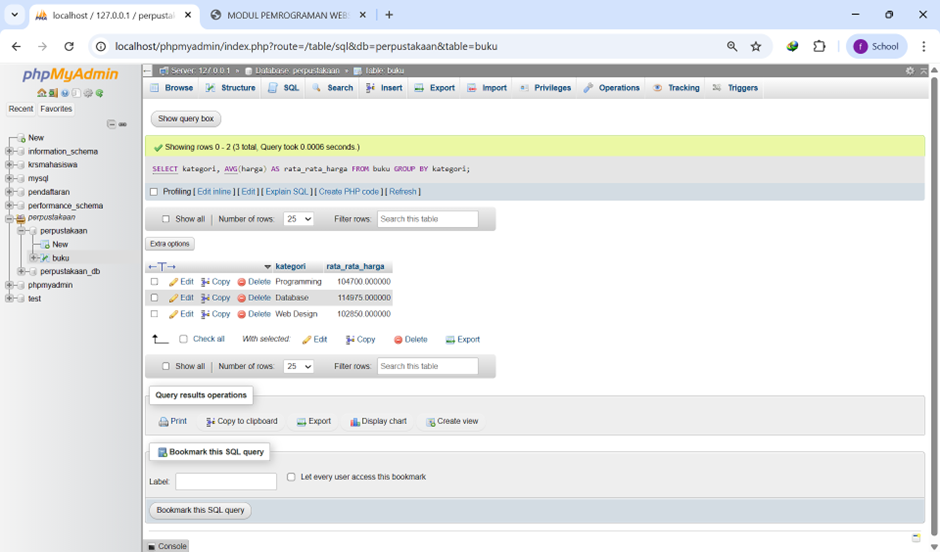

### 13. Kategori dengan total nilai inventaris terbesar
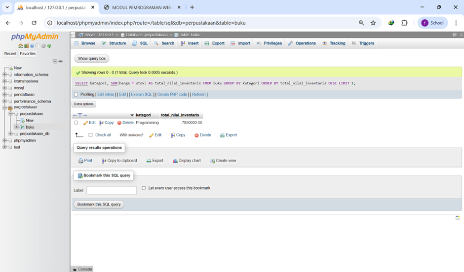

### 14. Update harga kategori Programming naik 5 persen
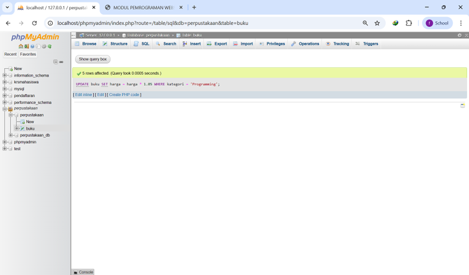

### 15. Update stok +10 untuk buku dengan stok < 5
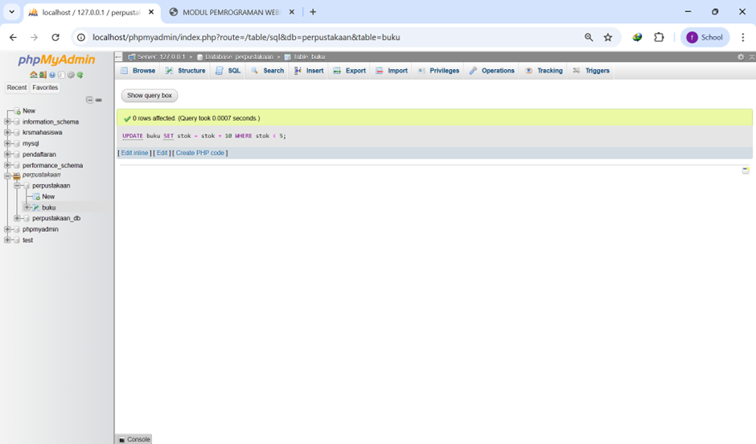

### 16. Daftar buku yang perlu restocking
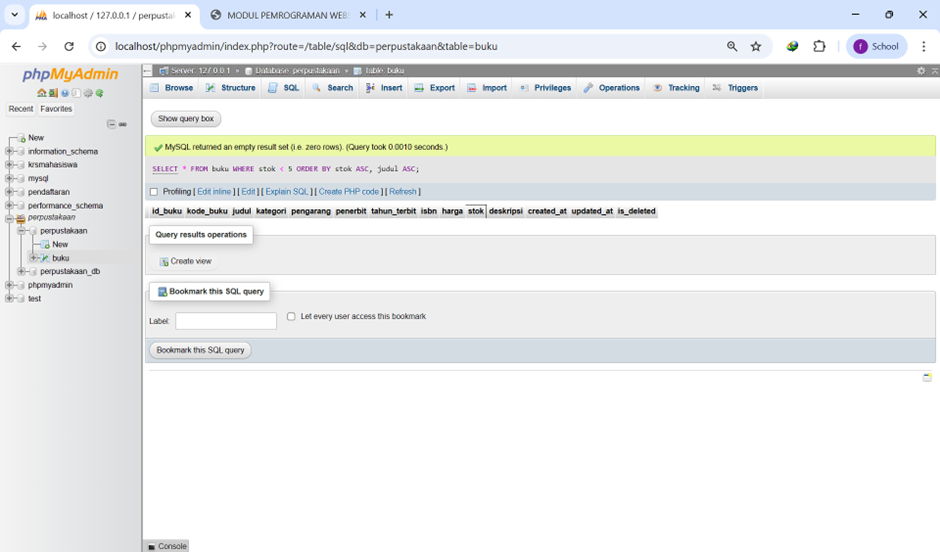

### 17. Top 5 buku termahal
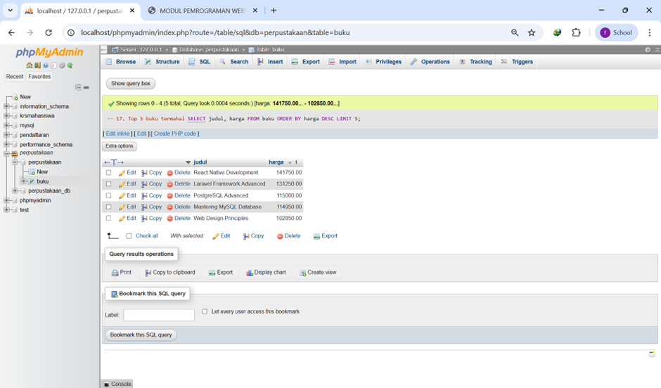

## Supaya Gambar Selalu Tampil

1. Simpan README.md di folder sql agar path relatif images/... sesuai.
2. Gunakan slash / pada path, misalnya images/1.png.
3. Pastikan nama file sama persis (termasuk huruf besar-kecil).
4. Pastikan folder images ikut disimpan saat push ke repository.
